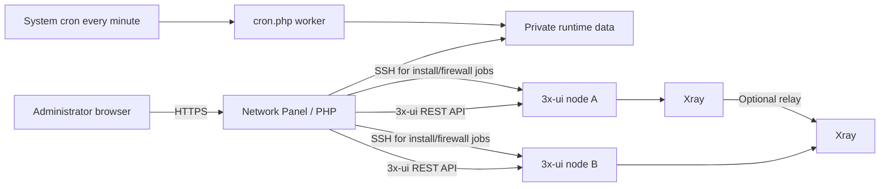

# 3x-ui Network Panel

[English](README_EN.md) | 简体中文

面向 3x-ui/Xray 的多服务器可视化组网面板。它可以集中管理服务器资源、创建 VLESS Reality 单节点、编排多跳链路、生成客户端链接、执行远程安装和防火墙任务，并在任务中心持续处理后台作业。

> 本项目不是 3x-ui 或 Xray-core 的官方项目。使用前请遵守所在地法律、上游项目许可和服务商规则。

## 主要功能

- 多服务器资源管理与连通性检查
- VLESS + Reality + RAW（Xray 内部值为 `tcp`）入口
- 客户端和服务端统一使用 `xtls-rprx-vision`
- SOCKS5 单节点入口与二维码分享
- 多跳链路编排和 Xray 路由模板
- Reality 目标候选自动探测并选择当前响应最快者
- 嗅探默认启用 HTTP、TLS、QUIC；仅路由开启、仅元数据关闭
- 节点/客户端配置写入后自动重启 Xray，再重启 3x-ui 面板
- 远程安装 3x-ui、防火墙、安全组和任务中心
- 审计日志、定时切换和后台任务队列
- 无固定默认密码；首次安装生成高强度随机密码

## 架构



面板服务器通过 3x-ui API 管理入站和 Xray 配置；只有远程安装、防火墙等明确任务才使用 SSH。`data/` 保存运行状态和凭据，已从 Git 仓库排除。

## 支持系统

安装器支持以下 64 位 Linux 发行版：

| 系统 | 最低版本 | 包管理器 |
|---|---:|---|
| Ubuntu | 22.04 | apt |
| Debian | 12 | apt |
| Rocky Linux / AlmaLinux / RHEL | 9 | dnf/yum |
| Fedora | 39 | dnf |

运行要求：PHP 8.0+、PHP cURL/mbstring/SQLite3/XML、SQLite、cron/crond、OpenSSH client、`sshpass`、`sudo`、cURL 和 Composer。`install.sh` 会检查并安装这些依赖。

## 安装

推荐使用 Git 克隆，这样以后可以正常持续更新：

```bash
git clone https://github.com/zhou1h/3xui-network-panel.git
cd 3xui-network-panel
sudo bash install.sh
```

安装器会：

1. 校验 Linux 发行版和版本；
2. 安装 PHP、SQLite、cron、SSH、`sshpass`、`sudo` 和 Composer；
3. 按 `composer.lock` 恢复 PHP 依赖；
4. 创建并保护 `data/`；
5. 首次安装使用 PHP `random_int()` 生成 28 位高强度随机密码；
6. 写入 `/etc/cron.d/3xui-network-panel` 并启动 cron 服务。

随机管理密码只在终端显示一次，不写入 Git、运行日志或固定模板。请立即保存到密码管理器。自动识别不到 Web 服务账户时，显式指定：

```bash
sudo bash install.sh --web-user www-data
```

如果需要重新生成管理密码：

```bash
sudo bash install.sh --reset-admin
```

### Web 服务器

把站点根目录或子路径指向本项目目录，并确保 PHP 请求能够执行。Nginx 还应直接拒绝访问运行数据：

```nginx
location ^~ /xui-switcher/data/ {
    return 404;
}
```

如果项目部署在域名根目录，请将路径改为 `location ^~ /data/`。不要关闭 `data/*.php` 自带的 404 防护。

## 正常持续更新

在 Git 克隆目录中执行：

```bash
cd /www/wwwroot/你的域名/3xui-network-panel
bash update.sh
```

`update.sh` 使用 `git pull --ff-only` 获取正常提交，再调用统一安装器更新依赖、权限和 cron。`data/` 与 `vendor/` 不参与提交，因此更新不会覆盖正式节点、任务、令牌或管理密码。如果存在未提交的本地源码修改，脚本会停止，避免覆盖。

开发者发布更新的标准流程：

```bash
git status
git add -A
git commit -m "Describe the update"
git push origin main
```

不要在正式运行目录中执行 `git add -f data/`，也不要把 `.gitignore` 排除的配置或运行数据强制提交。

## Reality 默认行为

- 传输：RAW（3x-ui 界面名称），Xray/分享链接中的值为 `tcp`
- 安全：Reality
- Flow：`xtls-rprx-vision`
- 嗅探：启用；目标协议为 HTTP/TLS/QUIC；仅元数据关闭；仅路由开启
- 目标：创建 Reality 入口时，从候选域名进行 TLS 探测并选择响应最快者；全部探测失败时回退到配置的默认目标
- 重启：入站、客户端和路由全部写入后，先重启 Xray，再重启 3x-ui 面板

自动目标的延迟由“运行本面板的服务器”测得，不代表每个客户端地区的最终延迟。目标必须支持可靠的 TLS 1.3；如果你的网络有特殊限制，请在状态配置中使用受控候选域名。

## 常见错误

### `sshpass: No such file or directory` / 退出码 127

旧安装缺少 `sshpass`。在项目目录重新执行：

```bash
sudo bash install.sh --update
```

### PHP 版本或 SQLite 扩展错误

执行预检：

```bash
sudo bash install.sh --check
```

安装器要求 PHP 8.0+，并逐项检查 `curl`、`mbstring` 和 `sqlite3` 扩展。

### Reality only supports RAW, XHTTP and gRPC

Reality 入站不能配成 WebSocket 或 mKCP。本项目默认生成 RAW；如果导入的是旧配置，请删除错误入站后重新创建。

### Reality 连接超时

确认客户端完整支持 `xtls-rprx-vision`，分享链接中包含 `flow=xtls-rprx-vision`，服务端和客户端的 SNI、公钥、Short ID、端口一致，并检查云防火墙与系统防火墙。

### 创建成功但任务一直等待

检查 cron：

```bash
sudo cat /etc/cron.d/3xui-network-panel
sudo systemctl status cron || sudo systemctl status crond
```

再次运行 `sudo bash install.sh --update` 会幂等修复 cron 和权限。

### 面板重启 API 报错

请升级目标服务器上的 3x-ui。当前面板在写入节点/客户端后调用 Xray 重启 API和面板重启 API；非常旧的 3x-ui 版本可能不提供对应端点。

## 卸载

只移除 cron 集成并保留运行数据：

```bash
sudo bash uninstall.sh
```

同时删除 `data/` 中的配置、令牌、节点和任务数据：

```bash
sudo bash uninstall.sh --purge-data
```

卸载脚本不会删除系统共享的 PHP、SQLite、Composer、SSH 或 sudo，也不会自动删除源码目录。确认备份后可自行删除项目目录。

## 安全说明

- `data/`、`vendor/`、日志、SQLite 文件和本地配置均由 `.gitignore` 排除。
- 安装器不会使用 `123456` 或其他固定默认密码。
- `app_secret` 未被业务使用，升级时会从现有配置移除。
- 正式环境应使用 HTTPS，并通过防火墙、VPN、Cloudflare Access 或 Web 服务器白名单限制管理入口。
- API Token、SSH 密码/密钥和导出的客户端链接都属于敏感信息，不应提交到公开仓库或截图公开。

## GitHub Topics

建议仓库 Topics：`3x-ui`、`x-ui`、`xray`、`reality`、`multi-server`、`network-panel`。
