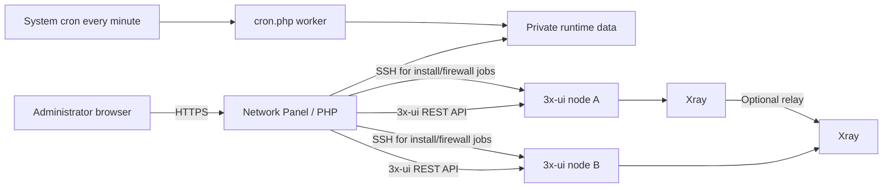

# 3x-ui Network Panel

English | [简体中文](README.md)

A visual multi-server orchestration panel for 3x-ui and Xray. It manages server resources, creates VLESS Reality endpoints, composes multi-hop routes, generates client links, runs remote installation and firewall jobs, and processes background tasks from one interface.

> This is not an official 3x-ui or Xray-core project. Follow local law, upstream licenses, and your service provider's terms.

## Features

- Multi-server inventory and connectivity checks
- VLESS + Reality + RAW endpoints (`tcp` in Xray configuration)
- `xtls-rprx-vision` on both server clients and generated client links
- SOCKS5 standalone endpoints and QR-code sharing
- Multi-hop route orchestration and managed Xray templates
- Automatic TLS probing of Reality candidates and selection of the fastest available target
- Sniffing for HTTP, TLS, and QUIC with route-only enabled and metadata-only disabled
- Automatic Xray restart followed by a 3x-ui panel restart after node/client changes
- Remote 3x-ui installation, firewall policy management, audit logs, scheduling, and job queue
- No fixed default password; a strong random password is created on first install

## Architecture



The panel uses the 3x-ui API for inbound and Xray configuration. SSH is used only for explicit installation and firewall tasks. Runtime state and credentials are stored under `data/`, which is excluded from Git.

## Supported systems

| Distribution | Minimum | Package manager |
|---|---:|---|
| Ubuntu | 22.04 | apt |
| Debian | 12 | apt |
| Rocky Linux / AlmaLinux / RHEL | 9 | dnf/yum |
| Fedora | 39 | dnf |

The installer provisions PHP 8.0+, PHP cURL/mbstring/SQLite3/XML, SQLite, cron/crond, OpenSSH client, `sshpass`, `sudo`, cURL, unzip, and Composer.

## Install

Use a Git clone so future updates can be applied normally:

```bash
git clone https://github.com/zhou1h/3xui-network-panel.git
cd 3xui-network-panel
sudo bash install.sh
```

The installer verifies the distribution, installs runtime dependencies, validates the Composer installer signature, restores `vendor/` from `composer.lock`, secures `data/`, installs `/etc/cron.d/3xui-network-panel`, and starts cron.

On a fresh install, PHP `random_int()` generates a 28-character administrator password. The plaintext is displayed once and is never written to Git, a template, or the application log. Store it immediately.

If the web-service account cannot be detected:

```bash
sudo bash install.sh --web-user www-data
```

To generate a new administrator password:

```bash
sudo bash install.sh --reset-admin
```

Protect runtime data in Nginx (adjust the prefix to match your deployment):

```nginx
location ^~ /xui-switcher/data/ {
    return 404;
}
```

## Continuous updates

From the Git clone:

```bash
cd /www/wwwroot/example/3xui-network-panel
bash update.sh
```

`update.sh` runs `git pull --ff-only` and then the idempotent installer. Runtime data, credentials, and `vendor/` are ignored by Git and are not overwritten. The update stops if local source changes are present.

Standard maintainer workflow:

```bash
git status
git add -A
git commit -m "Describe the update"
git push origin main
```

Never force-add ignored runtime files such as `data/config.php`, state, logs, or databases.

## Reality defaults

- Transport: RAW in the 3x-ui UI (`tcp` in Xray and share links)
- Security: Reality
- Flow: `xtls-rprx-vision`
- Sniffing: enabled for HTTP/TLS/QUIC; metadata-only off; route-only on
- Target: probe configured TLS candidates when a Reality endpoint is created, choose the fastest successful result, and use the configured fallback if all probes fail
- Restart: after all inbound/client/routing changes, restart Xray and then restart the 3x-ui panel

Target latency is measured from the server hosting this management panel, not from every client location. Candidates must provide reliable TLS 1.3 connectivity.

## Troubleshooting

### `sshpass: No such file or directory` / exit code 127

Run `sudo bash install.sh --update`. The unified installer now provisions `sshpass` and the other required commands.

### PHP version or SQLite extension error

Run `sudo bash install.sh --check`. PHP 8.0+ and the `curl`, `mbstring`, and `sqlite3` extensions are required.

### `Reality only supports RAW, XHTTP and gRPC`

Reality cannot use WebSocket or mKCP. Recreate the inbound as RAW. In Xray JSON and generated URLs, RAW is represented as `tcp`.

### Reality connection times out

Confirm that the client supports `xtls-rprx-vision`, the URL contains `flow=xtls-rprx-vision`, SNI/public key/Short ID/port match the server, and both cloud and host firewalls allow the port.

### Jobs remain pending

Check `/etc/cron.d/3xui-network-panel` and `systemctl status cron` (or `crond`). Running `sudo bash install.sh --update` safely repairs cron and permissions.

### Panel restart API fails

Upgrade 3x-ui on the target node. Very old versions may not expose the Xray and panel restart endpoints used after configuration changes.

## Uninstall

Remove cron integration while preserving runtime data:

```bash
sudo bash uninstall.sh
```

Remove cron and permanently delete runtime data:

```bash
sudo bash uninstall.sh --purge-data
```

Shared system packages and the source directory are intentionally preserved. Back up what you need, then remove the source directory manually.

## Security

- `.gitignore` excludes runtime data, dependencies, logs, databases, and local configuration.
- No fixed or predictable default password is used.
- The unused `app_secret` setting is removed during upgrade.
- Put the administrative UI behind HTTPS and an IP allowlist, VPN, firewall, or access gateway.
- Treat API tokens, SSH credentials, and exported client links as secrets.

Recommended GitHub Topics: `3x-ui`, `x-ui`, `xray`, `reality`, `multi-server`, `network-panel`.
